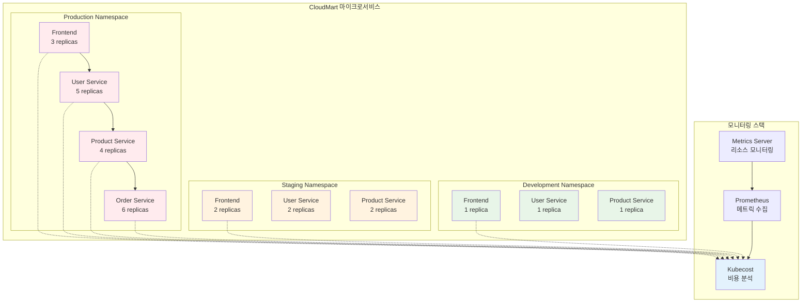

# Week 4 Day 5 Challenge 1: "CloudMart 비용 폭증 위기 대응"

<div align="center">

**🚨 비용 최적화** • **🔍 리소스 분석** • **🛠️ 자동화 구축**

*실제 운영 환경의 비용 폭증 상황 대응 시나리오*

</div>

---

## 🕘 Challenge 정보
**시간**: 15:15-16:45 (90분)
**목표**: 비용 폭증 원인 진단 및 최적화 능력 향상
**방식**: 문제 배포 → 진단 → 해결 → 검증

## 🎯 Challenge 목표

### 📚 학습 목표
- 체계적 비용 분석 능력
- 리소스 낭비 요소 식별
- 자동화된 비용 최적화

### 🛠️ 실무 역량
- Kubecost 기반 비용 분석
- HPA/VPA 최적화
- 리소스 Right-sizing

---

## 🚨 Challenge 시나리오: "CloudMart 비용 폭증 위기"

### 📖 배경 상황
**시나리오**:
E-Commerce 스타트업 "CloudMart"가 Kubernetes 기반 마이크로서비스로 전환한 후,
클라우드 비용이 예상보다 3배 증가했습니다. CFO가 긴급 비용 최적화를 요청했고,
DevOps 팀은 90분 내에 주요 낭비 요소를 찾아 해결해야 합니다.

**긴급도**: 🔴 **Critical**
**영향도**: 💰 **Very High** (월 $30,000 → $90,000)
**제한시간**: ⏰ **90분**

---

## 🏗️ 전체 아키텍처



---

## 🔧 Challenge 환경 배포

### Step 1: 클러스터 및 모니터링 설치
```bash
cd theory/week_04/day5/lab_scripts/challenge1
./setup-cluster.sh
```

**📋 스크립트 내용**: setup-cluster.sh

**설치 내용**:
- Kind 클러스터 (1 control-plane + 2 worker)
- Metrics Server
- Prometheus
- Kubecost (http://localhost:30090)
- 3개 네임스페이스 (production, staging, development)

### Step 2: 문제 시스템 배포
```bash
# 4가지 비용 낭비 시나리오 배포
kubectl apply -f broken-scenario1.yaml  # 과도한 리소스 할당
kubectl apply -f broken-scenario2.yaml  # HPA 미설정
kubectl apply -f broken-scenario3.yaml  # 불필요한 복제본
kubectl apply -f broken-scenario4.yaml  # 리소스 제한 누락
```

---

## 🚨 문제 상황 1: 과도한 리소스 할당 (25분)

### 증상
- Production 네임스페이스의 CPU/메모리 사용률이 20% 미만
- 할당된 리소스 대비 실제 사용량이 매우 낮음
- Kubecost에서 낭비 비용이 높게 표시됨

### 🔍 진단 과정

**1단계: 현상 확인**
```bash
# 네임스페이스별 리소스 사용률 확인
kubectl top pods -n production
kubectl top pods -n staging
kubectl top pods -n development

# Kubecost에서 비용 확인
# http://localhost:30090 접속
```

**2단계: 상세 분석**
```bash
# Pod별 리소스 할당 확인
kubectl describe pod -n production | grep -A 5 "Requests:"

# 실제 사용량 vs 할당량 비교
kubectl get pods -n production -o json | jq '.items[] | {name: .metadata.name, requests: .spec.containers[].resources.requests, limits: .spec.containers[].resources.limits}'
```

**3단계: 근본 원인 파악**
- 개발 초기에 설정한 과도한 리소스 할당
- 실제 워크로드 패턴 분석 없이 설정
- Right-sizing 미적용

### 💡 힌트
- Kubecost의 "Right-sizing" 추천 확인
- 실제 사용량의 1.2-1.5배로 조정
- requests와 limits 적절히 설정

**문제 파일**: broken-scenario1.yaml

---

## 🚨 문제 상황 2: HPA 미설정으로 인한 고정 복제본 (25분)

### 증상
- 트래픽이 적은 시간대에도 모든 Pod가 실행 중
- 야간/주말에도 동일한 복제본 수 유지
- 불필요한 리소스 비용 발생

### 🔍 진단 과정

**1단계: 현상 확인**
```bash
# HPA 설정 확인
kubectl get hpa -n production
kubectl get hpa -n staging

# 현재 복제본 수 확인
kubectl get deployments -n production
```

**2단계: 상세 분석**
```bash
# 시간대별 트래픽 패턴 확인 (Prometheus)
# CPU/메모리 사용 패턴 분석
kubectl top pods -n production --sort-by=cpu
```

**3단계: 근본 원인 파악**
- HPA 미설정으로 고정 복제본 수
- 트래픽 변동에 따른 자동 스케일링 부재
- 비용 효율성 저하

### 💡 힌트
- Production: min 2, max 10, CPU 70%
- Staging: min 1, max 5, CPU 70%
- Development: HPA 불필요 (고정 1개)

**문제 파일**: broken-scenario2.yaml

---

## 🚨 문제 상황 3: Staging/Development 환경의 과도한 복제본 (20분)

### 증상
- Staging 환경이 Production과 동일한 복제본 수
- Development 환경에 불필요한 다중 복제본
- 비프로덕션 환경의 과도한 비용

### 🔍 진단 과정

**1단계: 현상 확인**
```bash
# 네임스페이스별 복제본 수 확인
kubectl get deployments --all-namespaces

# 각 환경의 리소스 사용률
kubectl top pods -n staging
kubectl top pods -n development
```

**2단계: 상세 분석**
```bash
# 환경별 비용 비교 (Kubecost)
# Staging/Development의 필요성 분석
```

**3단계: 근본 원인 파악**
- 환경별 차별화 전략 부재
- Production 설정을 그대로 복사
- 비용 효율성 고려 부족

### 💡 힌트
- Staging: Production의 50% 수준
- Development: 최소 1개 복제본
- 불필요한 서비스 제거

**문제 파일**: broken-scenario3.yaml

---

## 🚨 문제 상황 4: 리소스 제한 누락으로 인한 노드 과부하 (20분)

### 증상
- 일부 Pod가 노드 리소스를 독점
- 다른 Pod들의 성능 저하
- 노드 추가로 인한 비용 증가

### 🔍 진단 과정

**1단계: 현상 확인**
```bash
# 리소스 제한 확인
kubectl get pods -n production -o json | jq '.items[] | {name: .metadata.name, limits: .spec.containers[].resources.limits}'

# 노드별 리소스 사용률
kubectl top nodes
```

**2단계: 상세 분석**
```bash
# limits 미설정 Pod 찾기
kubectl get pods --all-namespaces -o json | jq '.items[] | select(.spec.containers[].resources.limits == null) | .metadata.name'
```

**3단계: 근본 원인 파악**
- requests만 설정하고 limits 누락
- Pod가 무제한 리소스 사용 가능
- 노드 리소스 고갈 및 추가 노드 필요

### 💡 힌트
- limits는 requests의 1.5-2배
- CPU limits: 버스트 허용
- Memory limits: OOM 방지

**문제 파일**: broken-scenario4.yaml

---

## ✅ 해결 검증

### 자동 검증 스크립트
```bash
./verify-solution.sh
```

**📋 스크립트 내용**: verify-solution.sh

### 수동 검증 체크리스트

**✅ 시나리오 1: 리소스 Right-sizing**
```bash
# 리소스 사용률 확인 (50-80% 목표)
kubectl top pods -n production

# 예상: CPU 50-80%, Memory 50-80%
```

**✅ 시나리오 2: HPA 설정**
```bash
# HPA 동작 확인
kubectl get hpa -n production
kubectl get hpa -n staging

# 예상: Production (min:2, max:10), Staging (min:1, max:5)
```

**✅ 시나리오 3: 환경별 최적화**
```bash
# 복제본 수 확인
kubectl get deployments --all-namespaces

# 예상: Production > Staging > Development
```

**✅ 시나리오 4: 리소스 제한 설정**
```bash
# limits 설정 확인
kubectl get pods -n production -o json | jq '.items[0].spec.containers[0].resources'

# 예상: requests와 limits 모두 설정
```

---

## 🎯 성공 기준

### 📊 기능적 요구사항
- [ ] 모든 Pod에 적절한 리소스 할당
- [ ] HPA 정상 동작 (Production, Staging)
- [ ] 환경별 차별화된 복제본 수
- [ ] 모든 Pod에 리소스 제한 설정

### 💰 비용 절감 목표
- [ ] 전체 비용 50% 이상 절감
- [ ] Production: 30% 절감
- [ ] Staging: 60% 절감
- [ ] Development: 70% 절감

### ⚡ 성능 요구사항
- [ ] 리소스 사용률 50-80% 유지
- [ ] 응답 시간 변화 없음
- [ ] HPA 반응 시간 < 30초

---

## 🏆 도전 과제 (보너스)

### 고급 비용 최적화 (+20점)
1. **VPA 적용**: Vertical Pod Autoscaler로 자동 Right-sizing
2. **Cluster Autoscaler**: 노드 수 자동 조정
3. **Spot Instance**: 비용 60-90% 절감
4. **예약 인스턴스**: 장기 할인 적용

### 창의적 해결책 (+10점)
1. **비용 알림**: Slack/Email 알림 설정
2. **예산 관리**: 네임스페이스별 예산 제한
3. **비용 대시보드**: Grafana 대시보드 구축
4. **자동화**: 비용 최적화 자동화 스크립트

---

## 💡 문제 해결 가이드

### 🔍 체계적 진단 방법
1. **비용 가시성 확보**: Kubecost로 전체 비용 파악
2. **낭비 요소 식별**: 사용률 낮은 리소스 찾기
3. **우선순위 결정**: 비용 영향도 큰 것부터
4. **점진적 최적화**: 단계별 적용 및 검증
5. **지속적 모니터링**: 최적화 효과 추적

### 🛠️ 유용한 명령어
```bash
# 비용 분석
kubectl cost --namespace production

# 리소스 사용률
kubectl top pods --all-namespaces --sort-by=cpu
kubectl top nodes

# HPA 상태
kubectl get hpa --all-namespaces
kubectl describe hpa <hpa-name> -n <namespace>

# 리소스 설정 확인
kubectl get pods -o json | jq '.items[] | {name: .metadata.name, resources: .spec.containers[].resources}'
```

### 📊 Kubecost 활용
- **Allocation**: 네임스페이스/Pod별 비용
- **Savings**: 최적화 추천 사항
- **Reports**: 비용 트렌드 분석
- **Alerts**: 비용 임계값 알림

---

## 🧹 Challenge 정리
```bash
./cleanup.sh
```

**📋 스크립트 내용**: cleanup.sh

---

## 💡 Challenge 회고

### 🤝 팀 회고 (15분)
1. **가장 큰 비용 낭비 요소**: 어떤 문제가 가장 큰 영향을 미쳤나요?
2. **효과적인 분석 방법**: Kubecost를 어떻게 활용했나요?
3. **실무 적용 계획**: 실제 프로젝트에 어떻게 적용할 수 있을까요?
4. **자동화 아이디어**: 비용 최적화를 자동화할 수 있는 방법은?

### 📊 학습 성과
- **비용 분석 능력**: Kubecost 기반 체계적 분석
- **최적화 기술**: HPA, VPA, Right-sizing 적용
- **실무 경험**: 실제 비용 폭증 상황 대응
- **자동화 역량**: 지속적 비용 최적화 체계 구축

### 🎯 실무 적용 체크리스트
- [ ] 정기적 비용 리뷰 (주간/월간)
- [ ] 리소스 사용률 모니터링
- [ ] HPA/VPA 적용 확대
- [ ] 비용 알림 시스템 구축
- [ ] 팀 내 FinOps 문화 정착

---

<div align="center">

**💰 비용 최적화** • **📊 데이터 기반 의사결정** • **🤖 자동화** • **🎯 지속적 개선**

*Challenge를 통한 실전 FinOps 역량 강화*

</div>
