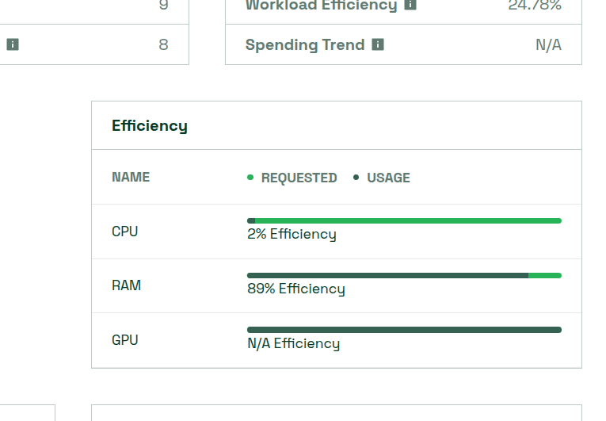
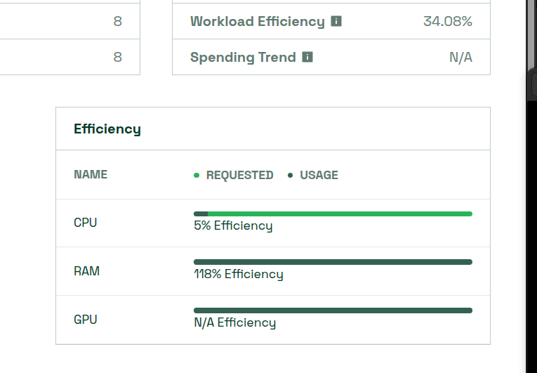

=== Challenge 해결 검증 시작 ===

1/4 시나리오 1 검증 중: 리소스 Right-sizing...
✅ 시나리오 1: 통과 (Frontend 리소스 최적화 완료)

2/4 시나리오 2 검증 중: HPA 설정...
✅ 시나리오 2: 통과 (HPA 설정 완료)

3/4 시나리오 3 검증 중: 환경별 최적화...
✅ 시나리오 3: 통과 (환경별 복제본 최적화 완료)

4/4 시나리오 4 검증 중: 리소스 제한 설정...
✅ 시나리오 4: 통과 (모든 Pod에 리소스 제한 설정 완료)

=== 검증 결과 ===
통과: 4/4
실패: 0/4

🎉 축하합니다! 모든 시나리오를 해결했습니다!

💰 예상 비용 절감 효과:
- 시나리오 1 (Right-sizing): 50-80% 절감
- 시나리오 2 (HPA): 30-60% 절감
- 시나리오 3 (환경별 최적화): 60-70% 절감
- 시나리오 4 (리소스 제한): 노드 과부하 방지

## 개선 전

## 개선 후

